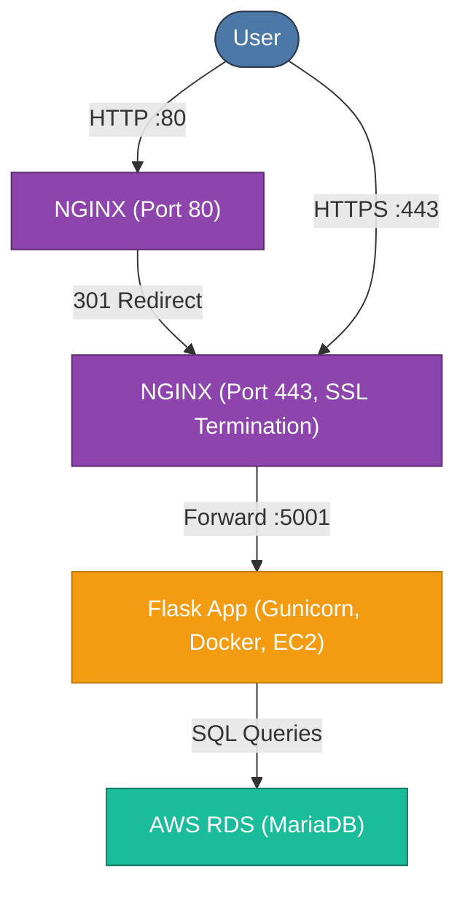

# Student Management System

A web-based Student Management System built with Flask and MariaDB. The system supports three roles (Admin, Instructor, Student) with separate dashboards and permissions.  

The system has been tested in a production-like setup on AWS (EC2 + RDS + Nginx). While not currently hosted to avoid costs, the deployment was validated with load testing (~100 concurrent users on t2.micro).

---

## Features

- **Role-Based Access Control** — Admin, Instructor, and Student dashboards  
- **Student Records** — Add, view, update, and delete student details  
- **Course & Grade Management** — Enrollments and grade tracking  
- **Custom Views** — Dashboards tailored to each user role  
- **Dockerized Deployment** — Run locally with Docker Compose, optionally deploy to AWS

## Architecture



---

## Technologies

- **Flask** — Backend framework  
- **MariaDB** — Database (local via Docker, or RDS in AWS deployment)  
- **Docker & Docker Compose** — Containerization and orchestration  
- **Nginx** — Reverse proxy (used in AWS deployment)  
- **SQLAlchemy** — ORM for database access  
- **Locust & Gunicorn** — Load testing and production server testing  

---

## How to Set It Up (Localhost)

Follow these steps to get the system running on your computer:

1.  **Get the Code:**
    ```bash
    git clone https://github.com/kanishkdhebana1/StudentManagementSystem
    cd StudentManagementSystem
    ```

2.  **Install Docker:**
    * **macOS and Windows:** Download and install Docker Desktop.
    * **Linux:**
        ```bash
        sudo apt update
        sudo apt install docker.io docker-compose
        ```

3.  **Run the Application:**
    ```bash
    docker-compose up --build
    ```
    This command will build and start the system using Docker. It sets up the Flask server and a MariaDB database, connecting them automatically.

4.  **Access the System:**
    * Open your web browser and go to: `http://localhost:5000`
    * Log in with your credentials to see your dashboard.

---

## Cloud Deployment (Optional, Tested)

Although not hosted live due to cost, this system has been deployed and tested on AWS with:

- EC2 for containerized app hosting

- RDS (MariaDB) for managed database

- Nginx as a reverse proxy

- Locust load testing showing stable performance up to ~100 concurrent users on t2.micro

## How to Use It

Once you log in, your dashboard will change based on your role:

* **Admin:** Manage all students, instructors, courses, and system settings.
* **Instructor:** View and update student grades, track progress, and communicate with students.
* **Student:** Sign up for courses, check your grades, and update your personal information.
